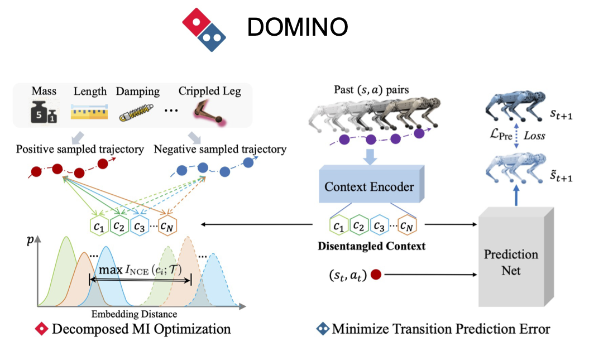

# DOMINO
## Decomposed Mutual Information Optimization for Generalized Context in Meta-Reinforcement Learning

TensorFlow 2.0 implementation of "DOMINO: Decomposed Mutual Information Optimization for Generalized Context in Meta-Reinforcement Learning" (NeuRIPS 2022).

The whole framework is shown as follow:


## Method

This paper addresses the multi-confounded challenge by decomposed mutual information optimization for context learning, which explicitly learns a disentangled context to maximize the mutual information between the context and historical trajectories while minimizing the state transition prediction error. 

- [Project webpage](https://sites.google.com/view/dominorl/)

## Instructions

Install required packages with below commands:

```
conda create -n domino python=3.6
pip install -r requirements.txt
```

Train and evaluate agents:

```
python -m run_scripts.run_domino --dataset [hopper,ant,halfcheetah,cripple_ant,cripple_halfcheetah] --normalize_flag
```


